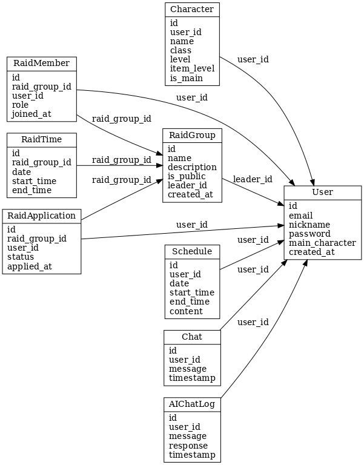

# MLOA 레이드 매니저 (MLOA Raid Manager)

> AI 매니저와 함께하는 MMORPG 공격대 일정 관리 서비스


## 📌 프로젝트 소개

MLOA 레이드 매니저는 MMORPG 게임(특히 로스트아크) 플레이어들의 레이드 일정을 효율적으로 관리하기 위한 서비스입니다. 게임 내 공격대를 운영하거나 참여하는 유저들이 자신의 일정을 AI 매니저와의 대화를 통해 쉽게 등록하고, 공격대원들의 일정을 취합하여 최적의 레이드 시간을 추천받을 수 있습니다.

### 🌟 주요 기능

- **AI 매니저와의 대화형 일정 관리**: 자연어로 일정을 말하면 AI가 분석하여 캘린더에 자동 등록
- **공격대 관리**: 공격대 생성, 멤버 관리, 권한 설정 등
- **공격대 일정 추천**: 멤버들의 가능한 시간을 분석하여 최적의 레이드 시간대 추천
- **개인 및 공유 캘린더**: 내 일정 관리 및 공개 설정을 통한 공유
- **캐릭터 관리**: 게임 내 캐릭터 정보 연동 및 관리 (BETA)

### 💡 개발 배경 및 동기

MMORPG에서 여러 명이 함께하는 레이드의 경우, 공대원들의 일정을 맞추는 과정이 매우 번거롭고 스트레스가 될 수 있습니다. 특히 누군가 한 명이 모든 일정을 취합하고 조율해야 하는 구조는 비효율적입니다. 

이 서비스는 AI를 활용하여 이러한 문제를 해결하고, 모든 공대원이 편리하게 자신의 일정을 공유하고 최적의 레이드 시간을 찾을 수 있도록 도와줍니다.

## 🛠️ 기술 스택

### 프론트엔드
- **Next.js**: SEO 최적화 및 정적/동적 페이지 생성을 위한 프레임워크
- **Tailwind CSS**: 반응형 UI 디자인
- **SWR/React Query**: 데이터 페칭 및 캐싱

### 백엔드
- **Nest.js**: 타입스크립트 기반의 백엔드 프레임워크
- **Prisma**: 데이터베이스 ORM
- **PostgreSQL**: 관계형 데이터베이스
- **JWT**: 사용자 인증

### 인프라
- **AWS 서비스 활용 예정**: EC2, S3, RDS 등
- **GitHub Actions**: CI/CD 파이프라인 구성 예정

## 📊 프로젝트 구조

```
MLOA_Raid_Manager/
├── docs/                      # 문서 (API 명세서, ERD 등)
├── frontend/                  # Next.js 프론트엔드
│   ├── public/                # 정적 파일
│   ├── src/
│   │   ├── app/               # 페이지 및 레이아웃
│   │   ├── components/        # UI 컴포넌트
│   │   ├── lib/               # 유틸리티 함수
│   │   ├── hooks/             # React hooks
│   │   └── services/          # API 서비스
│   ├── next.config.js
│   └── package.json
├── backend/                   # Nest.js 백엔드
│   ├── prisma/                # Prisma 스키마 및 마이그레이션
│   ├── src/
│   │   ├── modules/           # 기능별 모듈
│   │   ├── common/            # 공통 유틸리티
│   │   ├── config/            # 환경 설정
│   │   └── main.ts            # 진입점
│   ├── nest-cli.json
│   └── package.json
├── .github/                   # GitHub 설정
│   └── workflows/             # CI/CD 워크플로우
└── README.md                  # 프로젝트 설명
```

## 💻 페이지별 기능

### 메인 페이지
- 로그인/회원가입
- 서비스 소개 및 주요 기능 안내

### 내 일정
- 개인 일정 관리
- 월별/일별 캘린더 뷰
- AI 매니저와의 채팅 인터페이스

### 내 공대
- 공대 목록 및 생성
- 공대 정보 관리
- 공대원 관리 및 권한 설정
- 가입 신청 관리

### 공대 시간표
- 공대원들의 일정 통합 뷰
- 시간대별 가능 인원 시각화
- AI 추천 레이드 시간

### 공대 찾기
- 공개 공대 목록 브라우징
- 공대 정보 확인 및 가입 신청

### 캐릭터 관리 (BETA)
- 캐릭터 정보 연동
- 캐릭터 아이템 및 스펙 확인

## 🔄 API 구조

API는 RESTful 원칙을 따르며, 주요 엔드포인트는 다음과 같습니다:

- `/auth`: 인증 관련 (로그인, 회원가입, 로그아웃)
- `/schedules`: 개인 일정 관리
- `/characters`: 캐릭터 정보 관리
- `/raid-groups`: 공격대 그룹 관리
- `/ai/chat`: AI 매니저와의 채팅

상세 API 문서는 [API 명세서](./docs/api-specification.md)를 참조하세요.

## 📋 데이터 모델



주요 엔티티:
- `User`: 사용자 정보
- `Character`: 게임 캐릭터 정보
- `Schedule`: 개인 일정
- `RaidGroup`: 공격대 그룹
- `RaidMember`: 공격대 멤버
- `RaidSchedule`: 공격대 일정
- `Chat`: AI 매니저와의 대화 내역

## 🚀 설치 및 실행 방법

### 로컬 개발 환경 설정

1. 저장소 클론
   ```bash
   git clone https://github.com/yourusername/MLOA_Raid_Manager.git
   cd MLOA_Raid_Manager
   ```

2. 의존성 설치
   ```bash
   # 루트 디렉토리에서
   pnpm install

   # 프론트엔드
   cd frontend
   pnpm install

   # 백엔드
   cd ../backend
   pnpm install
   ```

3. 환경 변수 설정
   ```bash
   # 프론트엔드 (.env.local)
   cp frontend/.env.example frontend/.env.local

   # 백엔드 (.env)
   cp backend/.env.example backend/.env
   ```

4. 데이터베이스 설정
   ```bash
   cd backend
   pnpm exec prisma migrate dev
   ```

5. 개발 서버 실행
   ```bash
   # 프론트엔드 (http://localhost:3000)
   cd frontend
   pnpm dev

   # 백엔드 (http://localhost:4000)
   cd ../backend
   pnpm start:dev
   ```

## 👥 기여 방법

1. 이 저장소를 포크합니다.
2. 새로운 기능 브랜치를 생성합니다 (`git checkout -b feature/amazing-feature`).
3. 변경사항을 커밋합니다 (`git commit -m 'Add some amazing feature'`).
4. 브랜치에 푸시합니다 (`git push origin feature/amazing-feature`).
5. Pull Request를 생성합니다.

## 📜 라이센스

이 프로젝트는 MIT 라이센스 하에 배포됩니다. 자세한 내용은 [LICENSE](LICENSE) 파일을 참조하세요.

## 📬 연락처 및 문의사항

- GitHub Issues: [이슈 생성하기](https://github.com/yourusername/MLOA_Raid_Manager/issues)
- Email: this_is_laugh@naver.com

---

© 2025 MLOA Raid Manager. All Rights Reserved.